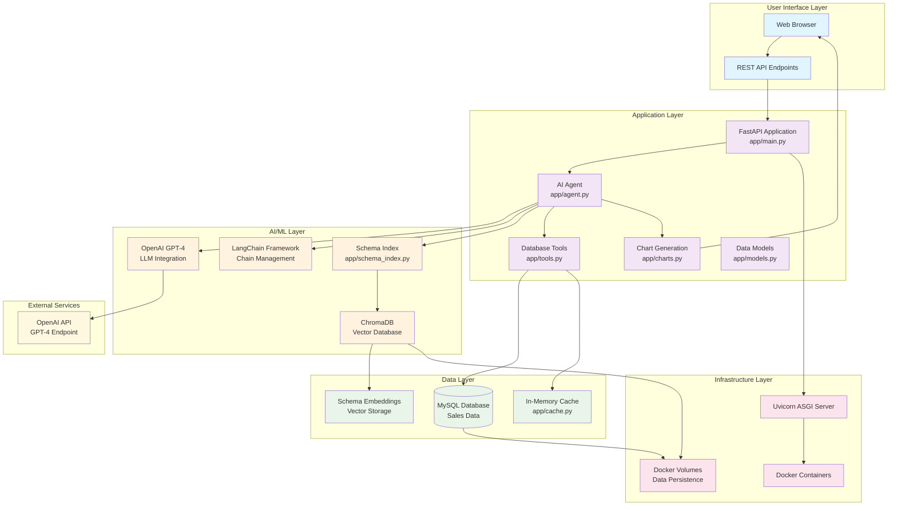
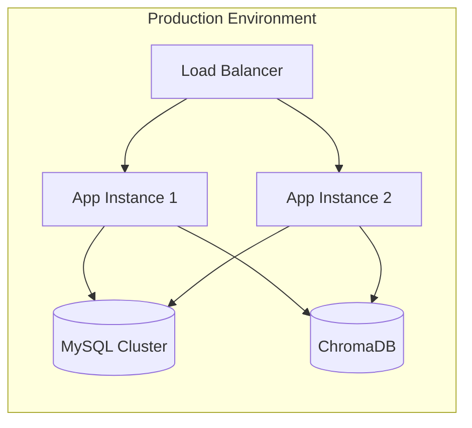

# NL-SQL Agent System Design

## Architecture Overview

This document provides a comprehensive system design diagram and explanation for the NL-SQL Agent project.

## System Architecture Diagram



## Component Details

### 1. User Interface Layer
- **Web Browser**: Frontend interface for user interaction
- **REST API**: HTTP endpoints for programmatic access

### 2. Application Layer
- **FastAPI Application**: Main web framework handling HTTP requests
- **AI Agent**: Core intelligence for SQL generation and query processing
- **Database Tools**: SQL execution, connection management, and data retrieval
- **Chart Generation**: Data visualization using Plotly
- **Data Models**: Pydantic models for data validation and serialization

### 3. AI/ML Layer
- **OpenAI GPT-4**: Large language model for natural language understanding
- **LangChain Framework**: Orchestrates AI workflows and prompt management
- **ChromaDB**: Vector database for semantic search and schema embeddings
- **Schema Index**: Manages database schema vectorization and learning

### 4. Data Layer
- **MySQL Database**: Primary data storage for sales information
- **In-Memory Cache**: Performance optimization for frequent queries
- **Schema Embeddings**: Vector representations of database schema

### 5. Infrastructure Layer
- **Docker Containers**: Containerized deployment and isolation
- **Uvicorn ASGI Server**: High-performance Python web server
- **Docker Volumes**: Persistent data storage

## Data Flow Process

### 1. Query Processing Flow
```
User Question → FastAPI → AI Agent → OpenAI GPT-4
                ↓
            Schema Index → ChromaDB → Schema Embeddings
                ↓
            Database Tools → MySQL → Query Results
                ↓
            Chart Generation → Plotly → HTML Visualization
                ↓
            Web Browser ← Response
```

### 2. Learning Flow
```
Successful Queries → Schema Index → ChromaDB
                ↓
            Vector Embeddings → Similarity Search
                ↓
            Enhanced Prompts → Better SQL Generation
```

### 3. Caching Flow
```
Query Request → Cache Check → Hit/Miss
                ↓
            Miss → Database Query → Cache Store
                ↓
            Hit → Return Cached Result
```

## Key Features

### 1. **Intelligent SQL Generation**
- Natural language to SQL conversion
- Context-aware query generation
- Error correction and fallback mechanisms

### 2. **Adaptive Learning System**
- Schema vectorization for better context
- Query pattern recognition
- Performance metrics and analytics

### 3. **Interactive Visualization**
- Automatic chart type detection
- Responsive HTML generation
- Export functionality (CSV)

### 4. **Performance Optimization**
- Connection pooling
- Query result caching
- Database indexing

### 5. **Scalability Features**
- Containerized deployment
- Horizontal scaling capability
- Persistent data storage

## Security Considerations

- **API Authentication**: Token-based authentication
- **SQL Injection Prevention**: Parameterized queries
- **Data Validation**: Pydantic model validation
- **Container Isolation**: Docker security boundaries

## Monitoring and Observability

- **Health Checks**: `/health` endpoint
- **Performance Metrics**: Query execution times
- **Error Logging**: Structured error tracking
- **Learning Analytics**: Success/failure rates

## Deployment Architecture



## Technology Stack

- **Backend**: Python 3.11+, FastAPI, SQLAlchemy
- **AI/ML**: OpenAI GPT-4, LangChain, ChromaDB
- **Database**: MySQL 8.0
- **Visualization**: Plotly
- **Infrastructure**: Docker, Docker Compose
- **Server**: Uvicorn ASGI server
- **Caching**: In-memory Python cache
- **Validation**: Pydantic

## Future Enhancements

- **Multi-database Support**: PostgreSQL, SQLite compatibility
- **Advanced Analytics**: Machine learning insights
- **Real-time Updates**: WebSocket support
- **API Versioning**: Semantic versioning
- **Advanced Caching**: Redis integration
- **Monitoring**: Prometheus/Grafana integration
